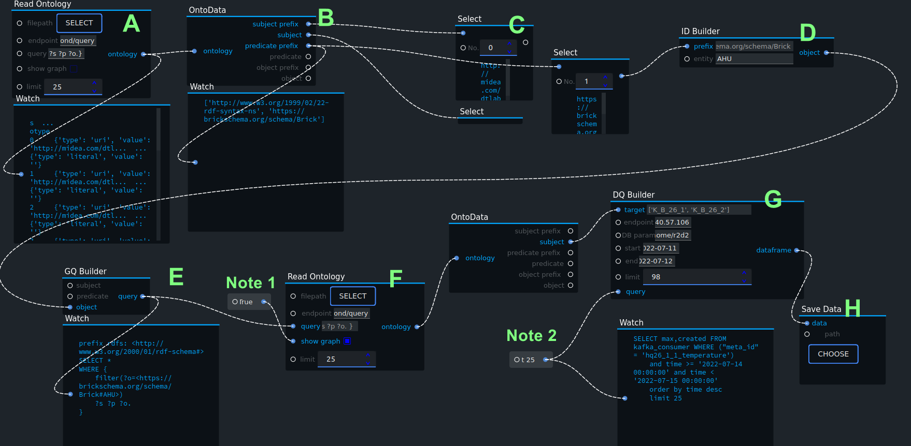
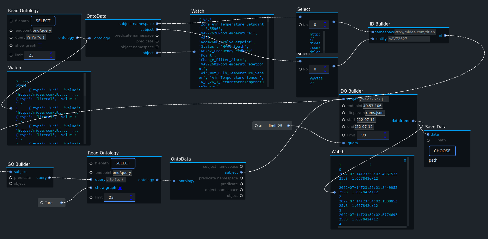

## 目录

*   [DataGraphic](#datagraphic)

*   [How It Works](#how-it-works)

*   [Usage](#usage)

*   [Installation](#installation)

*   [Config](#config)

*   [Acknowledgement](#acknowledgement)

*   [License](#license)

*   [Links](#links)

# DataGraphic

DataGraphic is a visual programming module for semantic web data reading in Ryven.

*   DataGraphic supports queries on local and cloud semantic web.

*   DataGraphic supports data visualization based on [JoyVis](https://github.com/joyhong85/JoyVis "JoyVis"), which used networkx, rdflib, and pyvis.

*   DataGraphic supports queries on relational database based on semantic queries.

# How It Works

An example of how the module works.

# Usage

1.  Read ontology is the first node in the workflow. Either load the local graph or use the remote server as an endpoint. The Query input can take custom Spark Queries, it is by default passive until activated. The Show Graph input takes boolean values to determine whether the queried graph is rendered. The Limit input takes integers to limit the amount of returned query results.

2.  OntoData converts graph results to lists. The graph results are split into prefixes and entities, categorized by subjects,  predicates, and objects.

3.  A Select module is used to get particular results from the lists, the results are assembled as potential entity names that you might want to query.

4.  The Entity ID later goes to the GraphQueryBuilder to get your desired results. This is not needed if you are familiar with Spark queries. Then, the query goes through ReadOntology and OntoData again.&#x20;

5.  Transfer the IDs of the queried entities to DataQueryBuilder, this node will get DataFrame based o the IDs from relational databases. The Query input can take custom SQL Queries, it is by default passive until activated. The Start and End inputs take String values to determine the time range. The Limit input takes integers to limit the amount of returned query results.

6.  The DataFrame is saved to .csv through Save Data.

# Installation

To use this module, Python environments are needed, better below 3.10, currently. Ryven is also a prerequisite, the installation guide is [here](https://github.com/leon-thomm/Ryven "here").

Import the nodes through the Ryven interface, and you can get started.

# Config

Connection with a remote relational database requires additional parameters in the db\_param.json file.

# Acknowledgement

This plug-in is supported by [Building-Technologies-Division](https://www.midea.com/cn/Our-Businesses/HVAC-Building-Technologies-Division)

# License

AGPL 3.0

# Links

*   [https://github.com/leon-thomm/Ryven](https://github.com/leon-thomm/Ryven "https://github.com/leon-thomm/Ryven")

*   [https://github.com/joyhong85/JoyVis](https://github.com/joyhong85/JoyVis "https://github.com/joyhong85/JoyVis")

